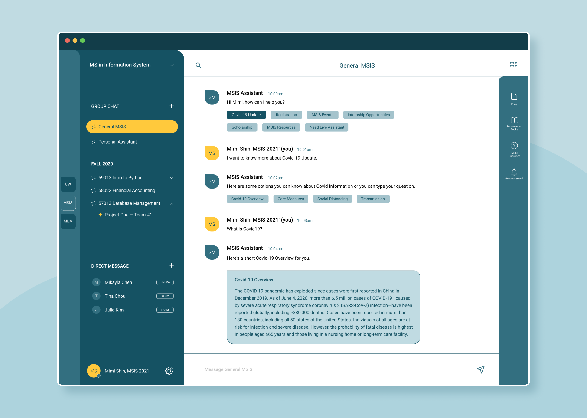

# Zigzag — Educational Communication Platform

Zigzag AI intelligent communication app is a combination of messaging tool and content management system for school for better and faster communication between schools and students in this remote learning era. Students can utilize chatbots in this system to get organized information faster, such as Covid-19 guidelines. This app can be easily integrated with other school systems, such as Canvas and student registration system.  With this communication app, students wouldn’t get lost in bombarding, decentralized and unorganized  messages and emails. Schools and teachers can also easily deliver organized information to target students.

Here's the demo [video](https://www.youtube.com/watch?v=uA21K4cel70&feature=youtu.be)

## Visual Prototype
The front-end code is still under construction but you can click around the [prototype](https://www.figma.com/proto/WRQEfbwl3Mxb5Wpu2X4S2V/Communication-Platform?node-id=1%3A2&scaling=scale-down) to learn more about Zigzag.

**Clone and play around with our chatbot that will be on the Zigzag platform.**

